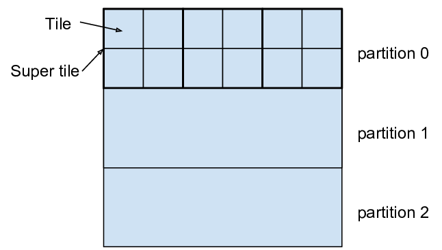
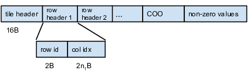
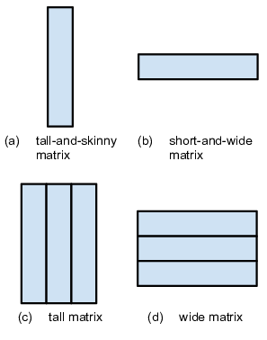
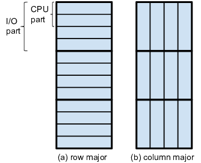

## Images 

You can reproduce our Read/Write throughput and the tilecache benchmarks using AWS EC2 instances.
The software stack can be installed on the EC2 instance using an install scripts.
After installing the backend, you can run the benchmarks in the paper using the benchmark scripts provided. 
The benchmark scripts are configurable to run the benchmark tests for different test configurations, for example running the benckmark for 32 threads.
The results of these benchmarks are stored in CSV files and you can use provided R scripts to generate the graphs as shown in the paper.

Table 3: Publicly available image data through NDStore. The key corresponds to the publication associated to the data, as given in Table 2. The token is a programmatic key which enables users to access the associated data. The URL corresponds to a location at which this data is viewable using our web viewer, NeuroDataViz.

| key |       token        | resolution (nm3; Hz) |     voxels / volume     | channels | total (GV) |
|-----|--------------------|----------------------|-------------------------|----------|------------|
| OHN | acardona_0111_8    | 4 x 4 x 45           | 32768 x 32768 x 4840    | 1        | 5196       |
| OHN | acardona_abd1_5    | 4 x 4 x 45           | 24576 x 24576 x 461     | 1        | 278        |
| DBN | bock11             | 4 x 4 x 45           | 135424 x 119808 x 1239  | 1        | 20102      |
| WSD | Ex10R55            | 100 x 100 x 70       | 3409 x 3337 x 70        | 29       | 23         |
| WSD | Ex12R75            | 100 x 100 x 70       | 5491 x 4749 x 35        | 21       | 19         |
| WSD | Ex12R76            | 100 x 100 x 70       | 5979 x 4872 x 37        | 21       | 22         |
| WSD | Ex13R51            | 100 x 100 x 70       | 5184 x 5840 x 30        | 21       | 19         |
| WSD | Ex14R58            | 100 x 100 x 70       | 4750 x 3410 x 41        | 26       | 17         |
| WSD | Ex2R18C1           | 100 x 100 x 70       | 2106 x 3236 x 42        | 25       | 7          |
| WSD | Ex2R18C2           | 100 x 100 x 70       | 1970 x 3175 x 42        | 25       | 6          |
| WSD | Ex3R43C1           | 100 x 100 x 70       | 2101 x 3223 x 69        | 26       | 12         |
| WSD | Ex3R43C2           | 100 x 100 x 70       | 1971 x 3164 x 69        | 26       | 11         |
| WSD | Ex3R43C3           | 100 x 100 x 70       | 1989 x 3252 x 69        | 26       | 11         |
| WSD | Ex6R15C1           | 100 x 100 x 70       | 3208 x 3581 x 30        | 21       | 7          |
| WSD | Ex6R15C2           | 100 x 100 x 70       | 3233 x 3636 x 30        | 21       | 7          |
| FLY | flycol             | 4 x 4 x 45           | 2000 x 2000 x 6240      | 1        | 24         |
| ANM | freeman14          | 650 x 650 x 5000; 0.8| 2048 x 1172 x 30 x 100  | 1        | 7          |
| BKC | kasthuri11         | 3 x 3 x 30           | 21504 x 26624 x 1849    | 1        | 1058       |
| BKC | kasthuri11cc       | 3 x 3 x 30           | 21504 x 26624 x 1849    | 1        | 1058       |
| BKC | kasthuri14Maine    | 2000 x 2000 x 30     | 6144 x 6144 x 2041      | 1        | 77         |
| BKC | kasthuri14s1colEM  | 30 x 30 x 30         | 49152 x 32768 x 254     | 1        | 409        |
| HSD | kharris15apical    | 2 x 2 x 50           | 8192 x 8192 x 194       | 1        | 13         |
| HSD | kharris15oblique   | 2 x 2 x 50           | 8192 x 8192 x 91        | 1        | 6          |
| HSD | kharris15spine     | 2 x 2 x 50           | 9000 x 9000 x 59        | 1        | 4          |
| WRM | ritaN2             | 5 x 5 x 60           | 13101 x 14378 x 1198    | 2        | 451        |
| WR  | ritaN2_5           | 5 x 5 x 60           | 37379 x 25986 x 742     | 2        | 1441       |
| WRM | ritaN2_four        | 5 x 5 x 60           | 28381 x 24234 x 321     | 2        | 441        |
| TKN | takemura13         | 4 x 4 x 45           | 12000 x 12000 x 1299    | 1        | 187        |
| LEE | lee14              |                      |                         |          |            |
| XBN | xbrain             |                      |                         |          |            |

Table 2: Publications assocated with data hosted by ndstore

| key |              reference               | datasets | modality |    species       |
|-----|--------------------------------------|----------|----------|------------------|
| OHN | Ohyama et al. Nature (2015)          | 2        | EM       | D. melanogaster  |
| DBN | Bock et al. Nature (2011)            | 1        | EM       | M. musculus      |
| WSD | Weiler et al. Scientific Data (2014) | 12       | AT       | M. musculus      |
| FLY | flycol                               | 1        | EM       | D. melanogaster  |
| ANM | Ahrens et al. Nature Methods (2013)  | 1        | Ophys    | D. rerio         |
| BKC | Kasthuri et al. Cell (2015)          | 4        | EM       | M. musculus      |
| HSD | Harris et al. Scientific Data (2015) | 3        | EM       | R. rattus        |
| WRM | Worm Atlas                           | 3        | EM       | C. elegans       |
| TKN | Takemura et al. Nature (2013)        | 1        | EM       | D. melanogaster  |
| XBN | Xbrain                               | 1        | Xray     |                  |
| LEE | Lee something                        |          |          |                  |
| CNC | Code Neuro Challenge                 |          |          |                  |

## Annotations

## Matrices

<figure><figcaption>Figure 7a: The format of a sparse matrix.</figcaption></figure>
<figure><figcaption>Figure 7b: The storage format of a tile.</figcaption></figure>

FlashX partitions a sparse matrix into tiles and store tiles in a very compact format
(Figure 7b). We use our own SCSR (Super Compressed Row Storage)
format for rows with more than one non-zero entry and the coordinate format (COO)
for rows with only one non-zero entry [25]. The SCSR format only stores data
for non-empty rows in a tile. A non-empty row contains a row header that has an
identifier to indicate the row number, followed by column
indices. The most significant bit of the identifier is always
set to 1, while the most significant bit of a column index
entry is always set to 0. As such, we can easily distinguish
a row identifier from a column index entry and determine
the end of a row. We use two bytes to store a row number and
a column index entry, which further reduces the storage size.
For the adjacency matrix of a real-world graph,
many rows in a cache tile have only one non-zero entry, owing
to the sparsity of the graphs and nearly random vertex
connection. The COO format for single-entry rows avoids many
conditional jumps without increasing the storage size.
All non-zero values are stored together at the end of a tile.

<figure><figcaption>Figure 8: Dense matrices of different shapes.</figcaption></figure>

FlashX supports dense matrices of different shapes (Figure 8).
It specifically optimizes tall-and-skinny matrices
and short-and-wide matrices, and stores tall matrices and wide matrices
as groups of tall-and-skinny matrices and short-and-wide matrices, respectively.
For a tall-and-skinny matrix and short-and-wide matrix, FlashMatrix supports
row-major and column-major matrix layout (Figure 9). As such,
we avoid data copy for common matrix operations such as matrix transpose.
FlashMatrix partitions TAS matrices horizontally
into I/O-level partitions. All elements in an I/O-level partition are stored
contiguously regardless of the data layout in the matrix. Each I/O
access reads the entire I/O-level partition, so the partition size determines an I/O
size, usually on the order of megabytes. The number of rows in an I/O-level
partition is always 2i.

## Explore

To recreate the Matrix Explorer panel first navigate to <a href="http://mx.neurodata.io/">Matrix-Explorer</a>, click on Demo (Iris Dataset), and proceed to the "Embedding \& Clustering" tab. The resultant window should look like the image shown in the subpanel.

<figure><figcaption>Figure 9</figcaption></figure>

## Graphs

## Reproducibility

## Links

## References 

[25] 
[Da Zheng, Disa Mhembere, Vince Lyzinski, Joshua T. Vogelstein, Carey E. Priebe, and Randal Burns, Semi-External Memory Sparse Matrix Multiplication on Billion-node Graphs in a Multicore Architecture, 2016.](http://arxiv.org/abs/1602.02864)

